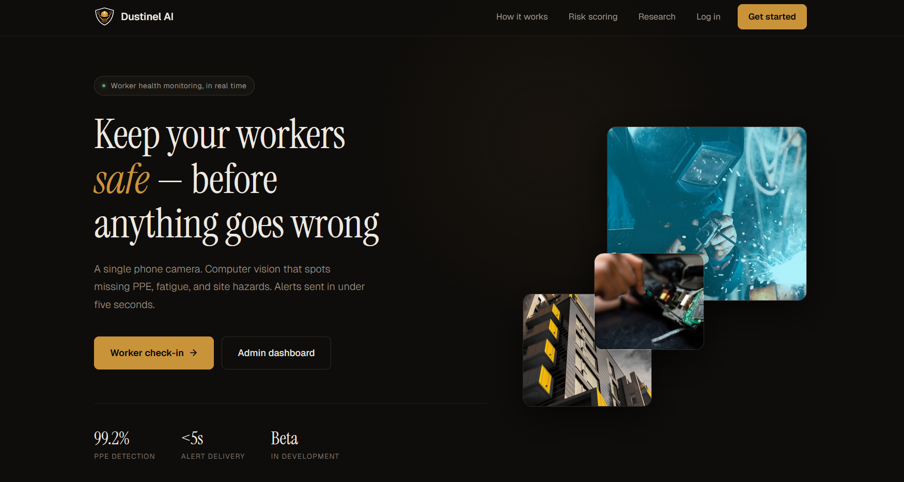
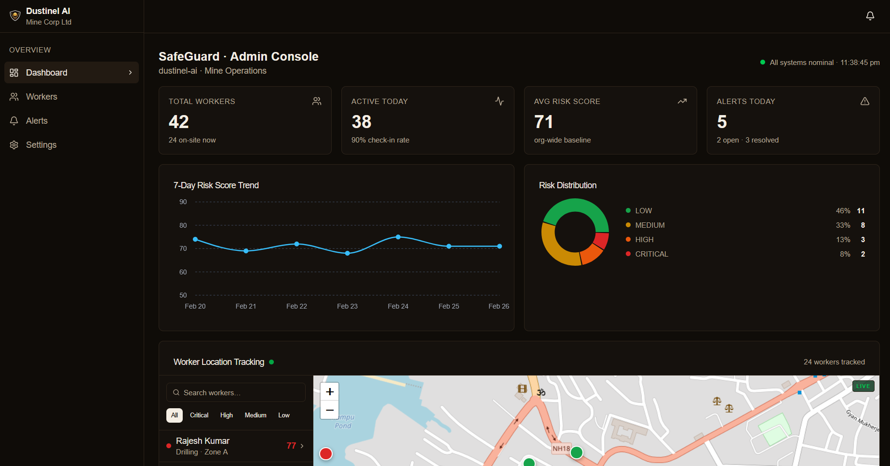
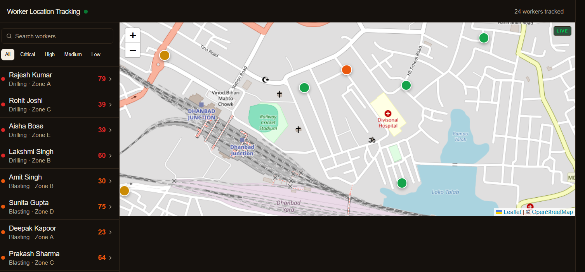

# 🛡️ Dustinel AI

**Worker Safety & Health Monitoring Platform**

Dustinel AI is an AI-powered worker safety and health monitoring platform designed for high-risk job sites such as construction, mining, manufacturing, and oil & gas. The system uses computer vision and machine learning to detect PPE compliance issues, fatigue indicators, and environmental hazards in real-time, preventing workplace incidents before they happen.

---

## 📋 Table of Contents

- [What is Dustinel AI?](#what-is-dustinel-ai)
- [How It Works](#how-it-works)
- [Key Features](#key-features)
- [Technology Stack](#technology-stack)
- [Project Structure](#project-structure)
- [Getting Started](#getting-started)
- [Environment Variables](#environment-variables)
- [API Endpoints](#api-endpoints)
- [Risk Classification System](#risk-classification-system)
- [Deployment](#deployment)

---

## What is Dustinel AI?

Dustinel AI is a comprehensive safety monitoring platform that:

1. **Workers** use a mobile check-in flow to capture face and environment photos at the start of their shift
2. The system **analyzes** those inputs using AI computer vision to detect:
   - PPE compliance (helmets, masks, safety glasses, vests)
   - Fatigue indicators (eye closure, yawning, facial droop)
   - Environmental hazards (dust levels, lighting conditions)
3. A **health risk score (0-100)** is calculated based on detected factors
4. **Risk levels** are classified: LOW, MEDIUM, HIGH, CRITICAL
5. **Real-time alerts** are triggered based on severity:
   - LOW: Logged to dashboard
   - MEDIUM: In-app notification to worker
   - HIGH: Push notification + email to supervisor
   - CRITICAL: Push + SMS + site access restriction

---

## How It Works

### Worker Check-In Flow

```
┌──────────────┐     ┌──────────────┐     ┌──────────────┐     ┌──────────────┐
│   Worker     │────▶│  Captures    │────▶│    AI         │────▶│   Risk       │
│   Starts     │     │  Face + Env  │     │   Analysis   │     │   Scoring    │
│   Check-In   │     │  Photos      │     │   (Azure AI) │     │   (0-100)    │
└──────────────┘     └──────────────┘     └──────────────┘     └──────────────┘
                                                                          │
                                                                          ▼
┌──────────────┐     ┌──────────────┐     ┌──────────────┐     ┌──────────────┐
│  Action      │◀────│  Alerts &    │◀────│   Risk       │◀────│  Results &   │
│  Taken       │     │  Notifica-   │     │   Level      │     │  Recommend-  │
│              │     │  tions       │     │  Classified  │     │  ations      │
└──────────────┘     └──────────────┘     └──────────────┘     └──────────────┘
```

### AI Analysis Process

1. **Face Image Analysis**:
   - PPE detection (helmet, mask, safety glasses, vest)
   - Face detection and orientation
   - Fatigue indicators detection
   - Skin exposure detection

2. **Environment Image Analysis**:
   - Dust level assessment (none, low, medium, high, extreme)
   - Lighting condition evaluation
   - Hazard detection (standing water, debris, equipment)
   - PPE-required zone verification

3. **Risk Score Calculation**:
   - Starts at 100 (perfect score)
   - Deductions applied based on detected issues
   - Weight factors for each risk type
   - Historical patterns considered

---

## Key Features

### Worker Features
- **Mobile Check-In**: Capture face and environment photos via camera
- **Real-Time Results**: View health score and risk level immediately
- **Personal Dashboard**: Track health history and trends
- **Safety Recommendations**: Receive personalized safety tips
- **Alert Notifications**: Get notified of risk changes

### Admin Features
- **Live Dashboard**: Monitor all workers and sites in real-time
- **Alert Management**: View, filter, and resolve safety alerts
- **Worker Management**: Add, edit, and manage worker profiles
- **Risk Analytics**: View risk trends, compliance rates, and heatmaps
- **Site Monitoring**: Track risk distribution across locations

---

## Screenshots

### Landing Page


### Admin Dashboard


### Worker Location Tracker


---

## Technology Stack

### Frontend
| Technology | Purpose |
|------------|---------|
| [Next.js 16](https://nextjs.org/) | React framework with App Router |
| [React 19](https://react.dev/) | UI library |
| [TypeScript](https://www.typescriptlang.org/) | Type safety |
| [Tailwind CSS 4](https://tailwindcss.com/) | Styling |
| [Framer Motion](https://www.framer.com/motion/) | Animations |
| [Radix UI](https://www.radix-ui.com/) | Accessible components |
| [Lucide React](https://lucide.dev/) | Icons |
| [Recharts](https://recharts.org/) | Charts and graphs |
| [Capacitor](https://capacitorjs.com/) | Mobile PWA wrapper |

### Backend
| Technology | Purpose |
|------------|---------|
| [Node.js](https://nodejs.org/) | JavaScript runtime |
| [Express](https://expressjs.com/) | Web framework |
| [NextAuth.js](https://next-auth.js.org/) | Authentication |
| [Zod](https://zod.dev/) | Schema validation |
| [Winston](https://github.com/winstonjs/winston) | Logging |
| [Multer](https://github.com/expressjs/multer) | File uploads |
| [Socket.IO](https://socket.io/) | Real-time updates |

### Azure Services
| Service | Purpose |
|---------|---------|
| [Azure AD B2C](https://learn.microsoft.com/azure/active-directory-b2c/) | User authentication |
| [Azure AI Vision](https://azure.microsoft.com/services/cognitive-services/computer-vision/) | Image analysis |
| [Azure Blob Storage](https://azure.microsoft.com/services/storage/blobs/) | Image storage |
| [Azure Cosmos DB](https://azure.microsoft.com/services/cosmos-db/) | NoSQL database |
| [Azure Notification Hubs](https://azure.microsoft.com/services/notification-hubs/) | Push notifications |
| [Azure Communication Services](https://azure.microsoft.com/services/communication-services/) | SMS & email |
| [Azure ML](https://azure.microsoft.com/services/machine-learning/) | Custom ML models |

---

## Project Structure

```
dustinel_ai/
├── app/                          # Next.js App Router pages
│   ├── admin/                    # Admin dashboard pages
│   │   ├── alerts/              # Alert management
│   │   ├── dashboard/           # Main admin dashboard
│   │   ├── settings/            # Admin settings
│   │   └── workers/             # Worker management
│   ├── auth/                     # Authentication pages
│   │   ├── login/               # Login page
│   │   └── register/           # Registration page
│   ├── worker/                  # Worker portal pages
│   │   ├── checkin/             # Check-in flow
│   │   ├── dashboard/           # Worker dashboard
│   │   ├── history/             # Health history
│   │   └── settings/           # Worker settings
│   ├── api/                     # API routes
│   │   └── auth/               # NextAuth endpoints
│   ├── globals.css             # Global styles
│   ├── layout.tsx              # Root layout
│   └── page.tsx                # Landing page
│
├── components/                  # React components
│   ├── ui/                     # Reusable UI components
│   │   ├── input.tsx
│   │   ├── label.tsx
│   │   ├── progress.tsx
│   │   ├── select.tsx
│   │   ├── separator.tsx
│   │   ├── skeleton.tsx
│   │   └── tabs.tsx
│   └── layout/                 # Layout components
│       ├── Footer.tsx
│       ├── Navbar.tsx
│       └── Sidebar.tsx
│
├── lib/                         # Utility libraries
│   ├── api.ts                  # API client functions
│   ├── auth.ts                 # Authentication utilities
│   ├── constants.ts            # App constants
│   └── utils.ts                # Helper functions
│
├── public/                     # Static assets
│   └── manifest.json           # PWA manifest
│
├── src/                        # Source configuration
│   └── config/                 # Configuration files
│       ├── env.ts              # Environment variables
│       └── azure.config.ts    # Azure client setup
│
├── types/                      # TypeScript types
│   ├── api.ts                 # API response types
│   ├── health.ts              # Health-related types
│   └── worker.ts              # Worker types
│
├── android/                   # Android native app (Capacitor)
├── package.json               # Dependencies
├── next.config.ts             # Next.js config
├── tsconfig.json              # TypeScript config
├── tailwind.config.ts         # Tailwind config
└── Documentation.md           # Detailed documentation
```

---

## Getting Started

### Prerequisites

- Node.js 18+
- npm or yarn
- Azure account (for cloud deployment)
- Azure Cosmos DB
- Azure Blob Storage
- Azure AI Vision

### Installation

1. **Clone the repository**:
   ```bash
   git clone <repository-url>
   cd dustinel_ai
   ```

2. **Install dependencies**:
   ```bash
   npm install
   ```

3. **Set up environment variables**:
   ```bash
   cp .env.example .env.local
   ```

4. **Configure environment variables** (see below)

5. **Run development server**:
   ```bash
   npm run dev
   ```

6. **Open browser**:
   ```
   http://localhost:3000
   ```

### Building for Production

```bash
npm run build
npm start
```

---

## Environment Variables

### Required Environment Variables

Create a `.env.local` file with the following variables:

```env
# Server Configuration
NODE_ENV=development
PORT=5000
NEXT_PUBLIC_API_URL=http://localhost:5000/v1
NEXT_PUBLIC_APP_URL=http://localhost:3000

# Authentication
AUTH_PROVIDER=mock
NEXTAUTH_SECRET=your-secret-key
NEXTAUTH_URL=http://localhost:3000

# Azure AD B2C
AZURE_AD_B2C_TENANT=your-tenant.b2clogin.com
AZURE_AD_B2C_TENANT_ID=your-tenant-id
AZURE_AD_B2C_CLIENT_ID=your-client-id
AZURE_AD_B2C_USER_FLOW=B2C_1_signupsignin
NEXT_PUBLIC_B2C_TENANT=your-tenant
NEXT_PUBLIC_B2C_CLIENT_ID=your-client-id
NEXT_PUBLIC_B2C_USER_FLOW=B2C_1_signupsignin

# Azure AI Vision
AZURE_VISION_ENDPOINT=https://your-resource.cognitiveservices.azure.com
AZURE_VISION_KEY=your-vision-key
VISION_PROVIDER=hybrid

# Azure Blob Storage
AZURE_STORAGE_ACCOUNT_NAME=your-storage-account
AZURE_STORAGE_CONNECTION_STRING=your-connection-string
AZURE_STORAGE_CONTAINER_NAME=safeguard-images

# Azure Cosmos DB
COSMOS_ENDPOINT=https://your-cosmos-db.azure.com:443
COSMOS_KEY=your-cosmos-key
COSMOS_DATABASE_NAME=safeguardai

# Azure ML (Optional)
AZURE_ML_ENDPOINT=https://your-ml-endpoint.azure.com/score
AZURE_ML_API_KEY=your-ml-key

# Azure Communication Services (Optional)
AZURE_COMMUNICATION_CONNECTION_STRING=your-communication-connection-string
```

---

## API Endpoints

### Authentication
| Method | Endpoint | Description |
|--------|----------|-------------|
| POST | `/v1/auth/login` | Login with Azure token |
| POST | `/v1/auth/refresh` | Refresh access token |
| POST | `/v1/auth/logout` | Logout user |
| GET | `/v1/auth/me` | Get current user |

### Check-In
| Method | Endpoint | Description |
|--------|----------|-------------|
| GET | `/v1/upload/sas` | Get SAS URL for image upload |
| POST | `/v1/checkin` | Submit check-in |
| GET | `/v1/checkin/:jobId` | Get check-in status |

### Workers
| Method | Endpoint | Description |
|--------|----------|-------------|
| GET | `/v1/workers` | List workers |
| GET | `/v1/workers/:id` | Get worker details |
| GET | `/v1/workers/:id/history` | Get worker health history |
| GET | `/v1/workers/:id/stats` | Get worker statistics |
| POST | `/v1/workers` | Create worker |
| PUT | `/v1/workers/:id` | Update worker |

### Admin
| Method | Endpoint | Description |
|--------|----------|-------------|
| GET | `/v1/admin/dashboard` | Get dashboard summary |
| GET | `/v1/admin/alerts` | List alerts |
| POST | `/v1/admin/alerts/:id/resolve` | Resolve alert |
| GET | `/v1/admin/analytics/risk-trend` | Get risk trends |
| GET | `/v1/admin/analytics/compliance` | Get compliance data |

---

## Risk Classification System

| Risk Level | Score Range | Color | Action |
|------------|-------------|-------|--------|
| LOW | 80-100 | 🟢 Green | No alert. Logged to dashboard. |
| MEDIUM | 60-79 | 🟡 Yellow | In-app notification to worker. |
| HIGH | 40-59 | 🟠 Orange | Push notification + email to supervisor. |
| CRITICAL | 0-39 | 🔴 Red | Immediate push + SMS + site access restriction. |

### Risk Score Deductions

| Factor | Deduction |
|--------|------------|
| No Mask | -30 |
| No Helmet | -25 |
| Extreme Dust | -20 |
| High Dust | -10 |
| Poor Lighting | -10 |
| Per Hazard | -5 (max -20) |
| High Fatigue | -15 |
| Medium Fatigue | -8 |
| Night Shift | -5 |
| Previous Low Score | -5 |
| Chronic Condition | -5 |

---

## Deployment

### Deploying to Azure

1. **Create Azure Resources**:
   - Azure App Service (Web App)
   - Azure Cosmos DB
   - Azure Blob Storage
   - Azure AI Vision
   - Azure Notification Hubs

2. **Configure Environment Variables** in Azure App Service

3. **Deploy using Azure CLI**:
   ```bash
   az webapp deployment source config-local-git --name <app-name> --resource-group <rg-name>
   git remote add azure <deployment-url>
   git push azure main
   ```

### Building Android App

```bash
npm run build
npx capacitor sync android
npx capacitor run android
```

---

## License

MIT License

---

## Support

For questions or support, please contact the development team.
